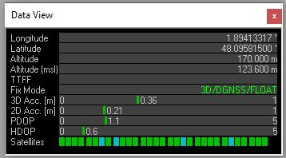

## Join the French GNSS RTK Project : `centipede`

Documentation available here : <https://docs.centipede.fr/>

5. Getting ready to RTK FIX :)

* Open the Data window :

In `ucenter` : View, Docking windows, Data

Go outside and wait for a few minute...

The RTK Led on the `simplertk2b` board should start blinking (that means RTCM frames are received) then the RTK led will turn OFF (that means you've got an RTK FIX)



Your RTK Base is ready !

You can go to `ucenter` : View, Messages View, UBX-NAV (Navigation)-HPPOSECEF (High Precision Position ECEF) to view the estimated accuracy

### Build the RTK base

* Update the GNSS F9P Firmware

Follow instruction here : <https://docs.centipede.fr/docs/base/Installation.html>

Uncheck all 4 options. 

Lastest firmware is available from [u-blox web site](https://www.u-blox.com/en/product/zed-f9p-module#tab-documentation-resources)

As of 2020/04/04, I used the 1.13 version.

* Upgrade your distribution

```bash
#Upgrade your raspberry image
sudo apt-get update
sudo apt-get upgrade
```

* Follow the manual or automatic installation described here : <https://github.com/Stefal/rtkbase>


Ref

https://learn.sparkfun.com/tutorials/setting-up-a-rover-base-rtk-system/rover-setup
https://learn.sparkfun.com/tutorials/gps-rtk-hookup-guide/all

Xbee baudrate
https://www.ardusimple.com/question/xbee-radio-specs-baud/