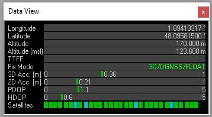

# gnss-rtk

GNSS: Global Navigation Satellite System (GNSS). 

In French : Géolocalisation et Navigation par un Système de Satellites

RTK : Real Time Kinematic 

In French : Cinématique temps réel

## What is RTK ?

Here is a french documentation explaning what is RTK :<https://docs.centipede.fr/docs/centipede/2_RTK.html>

To cut a long story short, the architecture is made of :

* one still base that captures some special GPS frames and we knwo the exact position of this base

* one rover that captures some special GPS like the base but also receives some correction frames from the base through the NTrip protocol (Networked Transport of RTCM via Internet Protocol). See <https://en.wikipedia.org/wiki/Networked_Transport_of_RTCM_via_Internet_Protocol>

With this configuration, the rover is able to get centimeter localisation accuracy !

Below the board I am using : <https://www.ardusimple.com/simplertk2b/>


## Getting a RTK FIX

An easy way to get an RTK FIX is to use an existing NTRIP Caster.

This NTRIP Caster will send RTCM frames to the rover so it gets a RTK FIX.

In this configuration, you'll need :

* [`ucenter` software](https://www.u-blox.com/en/product/u-center)
* a laptop with an Internet connexion (WiFi or phone provider)
* a [multi-band GNSS antenna](https://store-drotek.com/910-da-910-multiband-gnss-antenna.html)
* a simplertk2b board with the ZED-F9P ublox chip
* a place with clear sky view (you will not get an RTK FIX inside your home)
* a NTRIP Caster/server and a NTRIP mount point next to where you live (it will send RTCM frames to your RTK base)

1. Updating the GNSS F9P Firmware

Lastest firmware is available from [u-blox web site](https://www.u-blox.com/en/product/zed-f9p-module#tab-documentation-resources)

To update the GNSS F9P Firware you have to use `ucenter`

Follow instructions here (it is in French) : <https://docs.centipede.fr/docs/base/Installation.html>

2. Connecting the `simplertk2b` board

Use an USB cable and connect the `USB+GPS` port to your laptop.

Connect the GNSS antenna to the `simplertk2b` 

Change the default baudrate for `UART1` and `UART2` to 115200 bauds :

* In `ucenter` : View, Configuration view, PRT (Ports) 


Don't forget to click the `send` button and to save this configuration permanently (Configuration View, CFG (configuration), Save current configuration, send button)

3. Setting the NTRIP Caster connexion

* In `ucenter` : Receiver, NTRIP Client...

I am using a Open source French NTRIP Caster :) : <https://docs.centipede.fr/>


Fill the NTRP Caster settings and choose a NTRIP mount point as close as where you live.

4. Checking NTRIP frames reception

* In `ucenter` : View, Messages View, UBX-RXM (Receiver Manager)-RTCM (RTCM input status)

You should see incomming RTCM messages


5. Go outside in a clear open sky space

After a few minutes, you'll see in the Data View the fix mode going to `3D/GNSS/FIXED`


Check the accuray, in `ucenter` : View, Messages View, UBX-NAV (Navigation)-HPPOSECEF (High Precision Position ECEF)


Bingo ! with the method you can easely check whether your `simplertk2b` board is operational.

## Configuring an RTK base

In this configuration, you'll need :

* [`ucenter` software](https://www.u-blox.com/en/product/u-center)
* a laptop with an Internet connexion
* a [multi-band GNSS antenna](https://store-drotek.com/910-da-910-multiband-gnss-antenna.html)
* a simplertk2b board with the ZED-F9P ublox chip
* a place with clear sky view (you will not get an RTK FIX inside your home)

1. Updating the GNSS F9P Firmware

Lastest firmware is available from [u-blox web site](https://www.u-blox.com/en/product/zed-f9p-module#tab-documentation-resources)

To update the GNSS F9P Firware you have to use `ucenter`

Follow instructions here (it is in French) : <https://docs.centipede.fr/docs/base/Installation.html>

2. Connecting the `simplertk2b` board

Use an USB cable and connect the `USB+GPS` port to your laptop.

Connect the GNSS antenna to the `simplertk2b` 

Change the default baudrate for `UART1` and `UART2` to 115200 bauds :

* In `ucenter` : View, Configuration view, PRT (Ports) 


Don't forget to click the `send` button and to save this configuration permanently (Configuration View, CFG (configuration), Save current configuration, send button)


## Join the French GNSS RTK Project : `centipede`

Documentation available here : <https://docs.centipede.fr/>

5. Getting ready to RTK FIX :)

Open the Data window :

* In `ucenter` : View, Docking windows, Data

Go outside and wait for a few minute...

The RTK Led on the `simplertk2b` board should start blinking (that means RTCM frames are received) then the RTK led will turn OFF (that means you've got an RTK FIX)



You can go to `ucenter` : View, Messages View, UBX-NAV (Navigation)-HPPOSECEF (High Precision Position ECEF) to view the estimated accuracy


### Build the RTK base

* Update the GNSS F9P Firmware

Follow instruction here : <https://docs.centipede.fr/docs/base/Installation.html>

Uncheck all 4 options. 

Lastest firmware is available from [u-blox web site](https://www.u-blox.com/en/product/zed-f9p-module#tab-documentation-resources)

As of 2020/04/04, I used the 1.13 version.

* Upgrade your distribution

```bash
#Upgrade your raspberry image
sudo apt-get update
sudo apt-get upgrade
```

* Follow the manual or automatic installation described here : <https://github.com/Stefal/rtkbase>

## Bill Of Material (BOM)

x2 ArduSimple : [simpleRTK2B](https://www.ardusimple.com/product/simplertk2b/) - SKU : AS-RTK2B-F9P-L1L2-NH-02 


## References

* simpleRTK2B Configuration files : <https://www.ardusimple.com/configuration-files/>

* simpleRTK2B Update and check firmware : <https://www.ardusimple.com/zed-f9p-firmware-update-with-simplertk2b/>

* simpleRTK2B hookup guide : <https://www.ardusimple.com/simplertk2b-hookup-guide/#hw_overview>

* https://github.com/Stefal/rtkbase

* Free French GNSS-RTK project : <https://centipede.fr/>

* https://drotek.gitbook.io/rtk-f9p-positioning-solutions/how-to-get-started

* https://www.ardusimple.com/tutorials

* https://github.com/goblimey/ntripcaster

* https://github.com/jancelin/rtkbase

* https://github.com/tomojitakasu/RTKLIB

* https://github.com/tomojitakasu/RTKLIB/blob/rtklib_2.4.3/readme.txt

* https://portal.u-blox.com/s/question/0D52p00009OYf76CAD/please-let-me-know-the-procedure-how-i-can-send-rtcm-message-from-base-to-rover-using-lora-packet