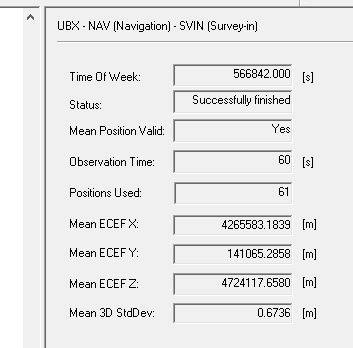

# gnss-rtk

GNSS: Global Navigation Satellite System (GNSS). 

In French : Géolocalisation et Navigation par un Système de Satellites

RTK : Real Time Kinematic 

In French : Cinématique temps réel

## What is RTK ?

Here is a french documentation explaning what is RTK :<https://docs.centipede.fr/docs/centipede/2_RTK.html>

To cut a long story short, the architecture is made of :

* one still base that captures some special GPS frames and we knwo the exact position of this base

* one rover that captures some special GPS like the base but also receives some correction frames from the base through the NTrip protocol (Networked Transport of RTCM via Internet Protocol). See <https://en.wikipedia.org/wiki/Networked_Transport_of_RTCM_via_Internet_Protocol>

With this configuration, the rover is able to get centimeter localisation accuracy !

Below the board I am using : <https://www.ardusimple.com/simplertk2b/>


This board is using the ZED-F9P u-blox chip, see Integration Manual : <https://www.u-blox.com/sites/default/files/ZED-F9P_IntegrationManual_%28UBX-18010802%29.pdf>

## Getting a Rover RTK FIX using a free NTRIP Caster

An easy way to get an RTK FIX is to use an existing NTRIP Caster.

This NTRIP Caster will send RTCM frames to the rover so it gets a RTK FIX.

In this configuration, you'll need :

* [`ucenter` software](https://www.u-blox.com/en/product/u-center)
* a laptop with an Internet connexion (WiFi or phone provider)
* a [multi-band GNSS antenna](https://store-drotek.com/910-da-910-multiband-gnss-antenna.html)
* a simplertk2b board with the ZED-F9P ublox chip
* a place with clear sky view (you will not get an RTK FIX inside your home)
* a NTRIP Caster/server and a NTRIP mount point next to where you live (it will send RTCM frames to your RTK base)

1. Updating the GNSS F9P Firmware

Lastest firmware is available from [u-blox web site](https://www.u-blox.com/en/product/zed-f9p-module#tab-documentation-resources)

To update the GNSS F9P Firware you have to use `ucenter`

Follow instructions here (it is in French) : <https://docs.centipede.fr/docs/base/Installation.html>

2. Configuring the `simplertk2b` board

* Use an USB cable and connect the `USB+GPS` port to your laptop.

* Connect the GNSS antenna to the `simplertk2b` 

* Change the default baudrate for `UART1` and `UART2` to 115200 bauds :

In `ucenter` : View, Configuration view, PRT (Ports) 


* Change measurement period to 200ms (5Hz) : 

In `ucenter` : View, Configuration view, RATE (Rates) - all time sources


**Don't forget to click the `send` button and to save this configuration permanently (Configuration View, CFG (configuration), Save current configuration, send button)**

3. Setting the NTRIP Caster connexion

* In `ucenter` : Receiver, NTRIP Client...

I am using a Open source French NTRIP Caster :) : <https://docs.centipede.fr/>


Fill the NTRP Caster settings and choose a NTRIP mount point as close as where you live.

4. Checking NTRIP frames reception

* In `ucenter` : View, Messages View, UBX-RXM (Receiver Manager)-RTCM (RTCM input status)

You should see incomming RTCM messages


5. Go outside in a clear open sky space

After a few minutes, you'll see in the Data View the fix mode going to `3D/GNSS/FIXED`


Check the accuray, in `ucenter` : View, Messages View, UBX-NAV (Navigation)-HPPOSECEF (High Precision Position ECEF)


Bingo ! with the method you can easely check whether your `simplertk2b` board is operational.

## Configuring an RTK base

In this configuration, you'll need :

* [`ucenter` software](https://www.u-blox.com/en/product/u-center)
* a laptop with an Internet connexion
* a [multi-band GNSS antenna](https://store-drotek.com/910-da-910-multiband-gnss-antenna.html)
* a simplertk2b board with the ZED-F9P ublox chip
* a place with clear sky view (you will not get an RTK FIX inside your home)

1. Updating the GNSS F9P Firmware

Lastest firmware is available from [u-blox web site](https://www.u-blox.com/en/product/zed-f9p-module#tab-documentation-resources)

To update the GNSS F9P Firware you have to use `ucenter`

Follow instructions here (it is in French) : <https://docs.centipede.fr/docs/base/Installation.html>

2. Connecting the `simplertk2b` board

Use an USB cable and connect the `USB+GPS` port to your laptop.

Connect the GNSS antenna to the `simplertk2b` 

Change the default baudrate for `UART1` and `UART2` to 115200 bauds :

* In `ucenter` : View, Configuration view, PRT (Ports) 


Don't forget to click the `send` button and to save this configuration permanently (Configuration View, CFG (configuration), Save current configuration, send button)

3. Configuring the board

* In `ucenter` : View, Messages View, UBX-NAV (Navigation)-PVT (Navigation PVT Solution)

* Estimation of the base position. In `ucenter` : View, Messages View, UBX-CFG (Config)-TMODE3 (Time Mode 3)

Choose either : `1-Survey-in` or `Fixed-Mode` and fill in the form depending on your choice.


Wait for a few minute and the receiver begins operation in timemode and can output a base position message if configured.


The survey-in status can be queried using the UBX-NAV-SVIN message.



Now you want the base station to output RTCM messages

* In `ucenter` : View, Messages View, UBX-CFG (Config) - MSG (Messages)

Enable all RTCM3.3 messages you want on the desired UART port.

Activating message below should be enough to get a RTK Fix 

```
F5-05 RTCM3.3 1005 Stationary ARP       
F5-4A RTCM3.3 1074 GPS MSM4             
F5-54 RTCM3.3 1084 GLONASS MSM4         
F5-5E RTCM3.3 1094 GALILEO MSM4         
F5-7C RTCM3.3 1124 Beidou MSM4          
F5-E6 RTCM3.3 1230 GLONASS code-phase   
```


You can refer to this nice tutorial for more information : <https://wiki.ardumower.de/index.php?title=Ardumower_Sunray>, and especially this part that shows RTK Base basic configuration : <https://wiki.ardumower.de/index.php?title=Ardumower_Sunray#What_are_the_differences_between_the_Ardumower_and_ArduSimple_ublox_receiver_configurations>

**Don't forget to click the `send` button and to save this configuration permanently (Configuration View, CFG (configuration), Save current configuration, send button)**

## Configuring a base and a rover communicating with 2 Xbees

Maybe you don't have any free open source NTRIP caster near your home and as a consequence, you may want to build your own RTK base and rover.

The RTK Base must be able to send RTCM3 correction frames to the rover. How can you achieve this ? You can find diffents methods on the Internet. I'll show you one that needs 2 XBees (I am using 2 `XBees PRO S5`)

1. Configure a RTK base, refers to `Configuring an RTK base` of this documentation

2. Configure a RTK Rover, refers to `Getting a Rover RTK FIX using a free NTRIP Caster` of this documentation but skip point 3 - Setting the NTRIP Caster connexion

3. Configure the 2 XBees that way:

* Use `XCTU` software, update firmware and reset to factory default


* Use this tutorial, to setup your Xbees : <https://www.digi.com/resources/documentation/digidocs/90001526/tasks/t_configure_2_devices_transparent_mode.htm>

**Base settings**

`NI` : RTK BASE
`ID` : 666 (the devil ID :)
`DH` : 0013A200 (should be the value of `SH`)
`DL` : 408BED48 (`SL` of Rover settings)
`BD` : 115200 (same baudrate that the `UART2 simplertk2b` board)


**Rover settings**

`NI` : RTK ROVER
`ID` : 666 (the devil ID :)
`DH` : 0013A200 (should be the value of `SH`)
`DL` : 408BEDD9  (`SL` of Base settings)
`BD` : 115200 (same baudrate that the `UART2 simplertk2b` board)


You can test that your settings is ok by sending a message thanks to `XCTU`


**Warning**

You may encounter `Duty cycle problem`, See <https://gr33nonline.wordpress.com/2016/03/25/using-xbee-868-as-rc/>

Symptom : Once in a while, the transmetting XBee will stop / hand (even though the GPS > XBee on the `simplertk2b` board is blinking...)

Resolution : Don't know yet...but maybe I will use the RESET pin of the XBee

4. Build the entire architecture

* Plug the RTK BASE XBee on the `simplertk2b` rtk base setup board

* Plug the RTK ROVER XBee on the `simplertk2b` rtk rover setup board

* Check that RTCM3 messages are received on the rtk rover side

Plug your `simplertk2b` rtk rover setup board using an USB cable on your laptop

In `ucenter` : View, Messages View, UBX-RXM (Receiver Manager)-RTCM (RTCM input status)

You should see incomming RTCM messages

systemctl status

## Bill Of Material (BOM)

* x2 ArduSimple : [simpleRTK2B](https://www.ardusimple.com/product/simplertk2b/) - SKU : AS-RTK2B-F9P-L1L2-NH-02 
* x2 Xbee PRO S5 (other versions should work...)
* [DA910 multi-band GNSS Antenna](https://store-drotek.com/910-da-910-multiband-gnss-antenna.html)
* [DA233 multi-band GNSS Antenna](https://store-drotek.com/925-da233.html)

## References

* simpleRTK2B Configuration files : <https://www.ardusimple.com/configuration-files/>

* simpleRTK2B Update and check firmware : <https://www.ardusimple.com/zed-f9p-firmware-update-with-simplertk2b/>

* simpleRTK2B hookup guide : <https://www.ardusimple.com/simplertk2b-hookup-guide/#hw_overview>

* https://github.com/Stefal/rtkbase

* Free French GNSS-RTK project : <https://centipede.fr/>

* https://drotek.gitbook.io/rtk-f9p-positioning-solutions/how-to-get-started

* https://www.ardusimple.com/tutorials

* https://github.com/goblimey/ntripcaster

* https://github.com/jancelin/rtkbase

* https://github.com/tomojitakasu/RTKLIB

* https://github.com/tomojitakasu/RTKLIB/blob/rtklib_2.4.3/readme.txt

* https://portal.u-blox.com/s/question/0D52p00009OYf76CAD/please-let-me-know-the-procedure-how-i-can-send-rtcm-message-from-base-to-rover-using-lora-packet

* Ardumower : <https://wiki.ardumower.de/index.php?title=Ardumower_Sunray>
