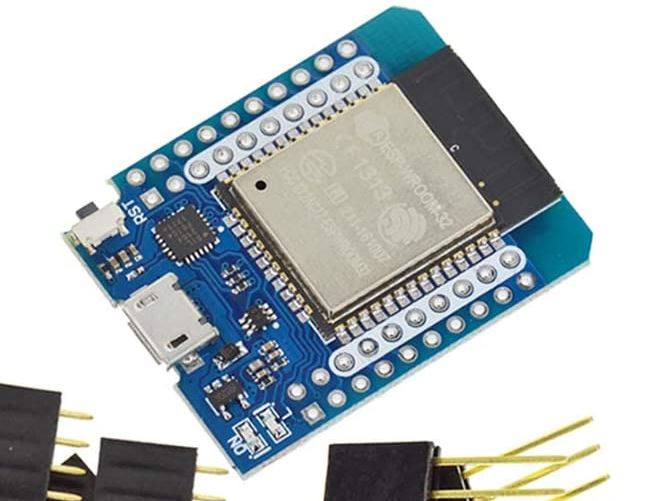
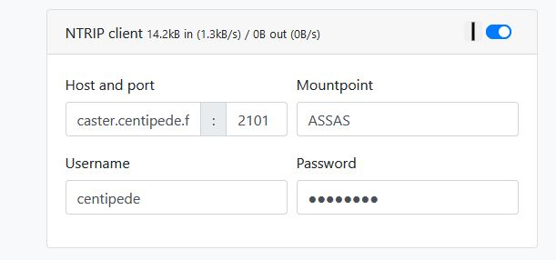
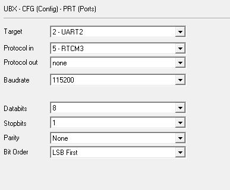
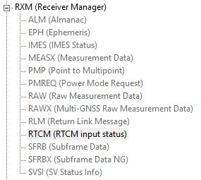

# WiFi NTRIP Master clone

I am using the `D1 mini ESP32` board

## Flashing the firmware

Follow the instruction here to flash the ESP32 : <https://github.com/nebkat/esp32-xbee/wiki/Firmware-Update> or <https://www.ardusimple.com/wifi-ntrip-master-firmware-update/>

## Getting started

Once the ESP32 is flashed. Use your smartphone to connect to the WiFi HotSpot (which must be called something like : `ESP_XBee_XXXX`)

Follow instruction here : <https://github.com/nebkat/esp32-xbee/wiki/Getting-Started>

First thing is to connect the ESP32 to your WiFi.

Use an IP Scanner like `Advanced IP Scanner` to retrieve the IP of the ESP32.

For instance, mine got the IP `192.168.1.137` with the name `esp32xbee`

You can access a log page by navigating to :  <http://192.168.1.137/log.html>

## WiFi NTRIP Master Hook up

* Configure your ESP32 as a NTRIP Client and use your favorite NTrip Caster

* Connect the ESP32 to the ArduSimple board (using XBee footprint)

* 3.3V ESP32 pin to 3.3V ArduSimple pin (XBee footprint)
* GROUND ESP32 pin to 3.3V ArduSimple pin (XBee footprint)
* RXD ESP32 Pin to TXD ArduSimple pin (XBee footprint)...Don't ask me why it is like that...

* See how to configure the [ArduSimple Rover here](../README.md)

UART2 should be configured that way

If everything is well configured you should see some RTCM messages comming, see here :

Some info here : <https://www.ardusimple.com/wifi-ntrip-master-hookup-guide/#overview>

## References

* <https://hackaday.io/project/26173-espbee-xbee-module>
* <https://github.com/CascoLogix/ESPBee/blob/master/ESPBee_Pinout.pdf>
* <https://www.ardusimple.com/wifi-ntrip-master-hookup-guide/#overview>