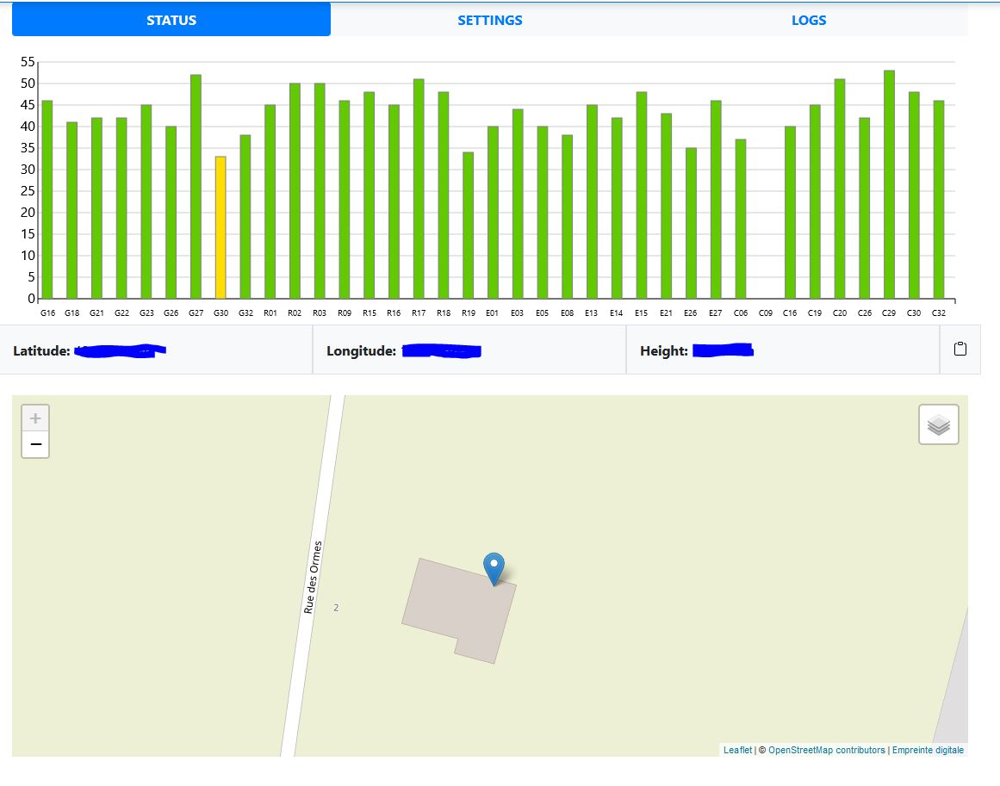
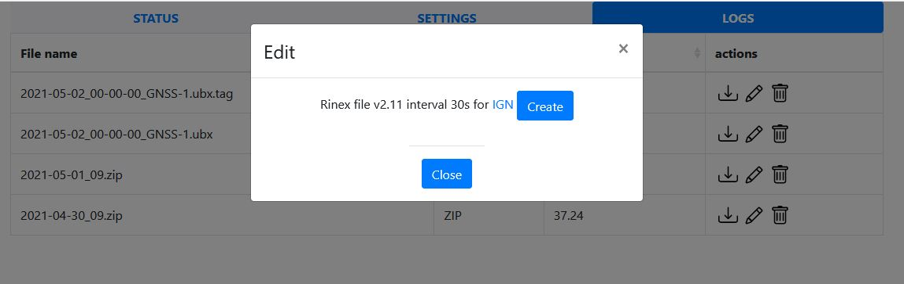
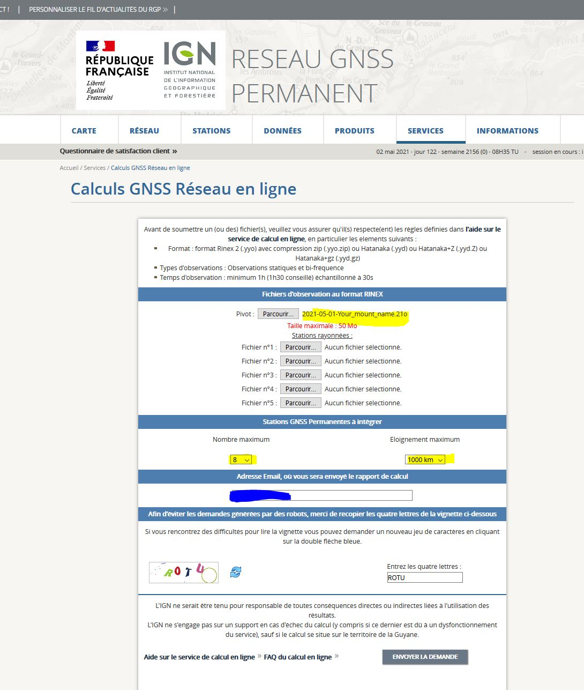

# Building an RTK Base

In this tutorial, we are using this project : <https://github.com/Stefal/rtkbase> to buidl an RTK Base

## Config and burn a brand new Raspberry image

Use this tutorial to configure and burn a ready config Raspberry image : <https://github.com/fguiet/homelab/blob/main/packer/paker.md>

```bash
# For instance, command I use to generate the image
docker run --rm --privileged -v /dev:/dev -v /applications/mkaczanowski/packer-builder-arm:/build -v /applications/homelab/packer/packer-raspberry:/applications/homelab/packer/packer-raspberry -v /applications/raspios:/applications/raspios packer-builder-arm:20210418 build /applications/homelab/packer/packer-raspberry/raspios-lite-arm64.json
```

## Bill Of Material (BOM)

* Raspberry 4 (2 giga of RAM) - RaspiOS 64 bits Lite
* SimpleRTK2B-F9P 
  * [SimpleRTK2B-F9P](https://www.ardusimple.com/product/simplertk2b-f9p-v3/)
  * [ZED-F9P module](https://www.u-blox.com/en/product/zed-f9p-module)
  * [DA910 multi-band GNSS Antenna](https://store-drotek.com/910-da-910-multiband-gnss-antenna.html)

## Setting up the SimpleRTK2B-F9P

* Flash the SimpleRTK2B-F9P with the last firmware (See [README.md](../README.md))

* Plug in your SimpleRTK2B-FT9 on your Raspberry

* Install the RTK base sotfware (see below)

  * See Point 8 below it will configure some stuff for us 

* Nothing more should be configured...

## Installation - The easy way

1. Installation de Pyenv 

Installation de Pyenv pour gérer plusieurs versions de Python pour l'utilisateur root

```bash
sudo apt-get update
sudo apt-get install -y build-essential libssl-dev zlib1g-dev libbz2-dev \
libreadline-dev libsqlite3-dev wget curl llvm libncurses5-dev libncursesw5-dev \
xz-utils tk-dev libffi-dev liblzma-dev python3-openssl git

# on passe sous root
sudo su -

cd /applications

# Install pyenv
curl https://pyenv.run | bash

# Add the following to .bashrc
# Pyenv Conf
export PYENV_ROOT="$HOME/.pyenv"
[[ -d $PYENV_ROOT/bin ]] && export PATH="$PYENV_ROOT/bin:$PATH"
eval "$(pyenv init -)"
eval "$(pyenv virtualenv-init -)"

# Activation
. ~/.bashrc

# Installation de la version 3.10.13
pyenv install 3.10.13

# Create a virtual env for version 3.10.13 of Python
pyenv virtualenv 3.10.13 rtkbase_python_3_10_13
```

2. Installation de rtkbase

```bash
cd /applications

wget https://raw.githubusercontent.com/Stefal/rtkbase/master/tools/install.sh -O install.sh
chmod +x install.sh
sudo ./install.sh --all release

#Ajouter ca en début de fichier install.sh pour activier python dans la bonne version
#. ~/.bashrc
#pyenv activate rtkbase_python_3_10_13

#Dans /etc/systemd/system/rtkbase_web.service, Mettre (pour lancer avec le bon environnement python)

#ExecStart=/root/.pyenv/versions/rtkbase_python_3_10_13/bin/python /applications/rtkbase/web_app/server.py

systemctl daemon-reload
systemctl restart rtkbase_web.service
```

## Installation

Most of what is described below are taken from : <https://github.com/Stefal/rtkbase>

1. Get the source code from GitHub

As of 2021/04/30, I am using the [release 2.2.0](https://github.com/Stefal/rtkbase/releases/tag/2.2.0)
As of 2023/12/06, I am using the [release 2.4.2](https://github.com/Stefal/rtkbase/releases/tag/2.4.2)

```bash
cd /applications
wget https://github.com/Stefal/rtkbase/releases/download/2.4.2/rtkbase.tar.gz
tar xvf rtkbase.tar.gz
rm rtkbase.tar.gz
```

2. Install Dependencies

```bash
cd /applications/rtkbase/tools
sudo ./install.sh --dependencies

#I am adding netcat..so I can decode RTCM frame later
sudo apt-get install netcat
```

3. Installation RTKLib

```bash
cd /applications/rtkbase/tools
sudo ./install.sh --rtklib
```

3.1 Installation de Pyenv pour gérer plusieurs versions de Python pour l'utilisateur root

```bash
sudo apt-get update
sudo apt-get install -y build-essential libssl-dev zlib1g-dev libbz2-dev \
libreadline-dev libsqlite3-dev wget curl llvm libncurses5-dev libncursesw5-dev \
xz-utils tk-dev libffi-dev liblzma-dev python3-openssl git

# on passe sous root
sudo su -

# Install pyenv
curl https://pyenv.run | bash

# Add the following to .bashrc
# Pyenv Conf
export PYENV_ROOT="$HOME/.pyenv"
[[ -d $PYENV_ROOT/bin ]] && export PATH="$PYENV_ROOT/bin:$PATH"
eval "$(pyenv init -)"
eval "$(pyenv virtualenv-init -)"

# Activation
. ~/.bashrc

# Installation de la version 3.10.13
pyenv install 3.10.13

# Create a virtual env for version 3.10.13 of Python
pyenv virtualenv 3.10.13 rtkbase_python_3_10_13
```

4. Install the rtkbase web frontend

As of 2023 - Do not do this step

```bash
#cd /applications/rtkbase/tools
#sudo ./install.sh --rtkbase-release

# This command will download the release from this branch (see rtkbase.tar.gz)
# https://github.com/Stefal/rtkbase/releases/tag/2.2.0
# Source code will be placed in the folder /applications/rtkbase/tools/rtkbase
#
# The following /etc/environment file will be modified with the frond end path
# rtkbase_path=/applications/rtkbase/tools/rtkbase
```

5. Install Rtkbase web front requirements

```bash
# The following /etc/environment file will be modified with the frond end path
# rtkbase_path=/applications/rtkbase/tools/rtkbase

# Activate virtualenv
pyenv activate rtkbase_python_3_10_13

# Install requirements for rtkbase
cd /applications/rtkbase/tools
python3 -m pip install --upgrade pip setuptools wheel  --extra-index-url https://www.piwheels.org/simple
python3 -m pip install -r ../web_app/requirements.txt  --extra-index-url https://www.piwheels.org/simple

pyenv deactivate 
```

6. Install systemd services

```bash
# Ajouter rtkbase_path=/applications/rtkbase dans /etc/environment

export rtkbase_path=/applications/rtkbase
echo $rtkbase_path

cd /applications/rtkbase/tools
sudo ./install.sh --unit-files

#
# Following services are installed
#
#/etc/systemd/system/str2str_tcp.service
#/etc/systemd/system/str2str_rtcm_svr.service
#/etc/systemd/system/str2str_rtcm_serial.service
#/etc/systemd/system/str2str_ntrip.service
#/etc/systemd/system/str2str_file.service
#/etc/systemd/system/rtkbase_web.service
#/etc/systemd/system/rtkbase_archive.timer
#/etc/systemd/system/rtkbase_archive.service

#Dans rtkbase_web.service, Mettre (pour lancer avec le bon environnement python)

#ExecStart=/root/.pyenv/versions/rtkbase_python_3_10_13/bin/python /applications/rtkbase/web_app/server.py

```

```bash
# Get service status
#RTKBase Tcpservice
systemctl status str2str_tcp.service
#RTKBase rtcm server
systemctl status str2str_rtcm_svr.service
#RTKBase serial rtcm output
systemctl status str2str_rtcm_serial.service
#RTKBase Ntrip
systemctl status str2str_ntrip.service
#RTKBase File - Log data
systemctl status str2str_file.service
#RTKBase Web Server
systemctl status rtkbase_web.service
#Run rtkbase_archive.service everyday at 04H00
systemctl status rtkbase_archive.timer
#RTKBase - Archiving and cleaning raw data
systemctl status rtkbase_archive.service
```

7. Install chrony and gpsd

```bash
cd /applications/rtkbase/tools
sudo ./install.sh --gpsd-chrony
#Launch this one again, otherwise `/etc/chrony/chrony.conf` not correctly set
sudo ./install.sh --gpsd-chrony

# Check `/etc/chrony/chrony.conf`, the line below should be added
# refclock SHM 0 refid GPS precision 1e-1 offset 0.2 delay 0.2

# Check `chrony.service` => After=gpsd.service
#cat /etc/systemd/system/chrony.service

# Check `gpsd.service` => cat /etc/systemd/system/gpsd.service
#[Unit]
#Description=GPS (Global Positioning System) Daemon
#Requires=gpsd.socket
#BindsTo=str2str_tcp.service
#After=str2str_tcp.service

# Check `gpsd` conf file => cat /etc/default/gpsd
# DEVICES="tcp://127.0.0.1:5015"
# GPSD_OPTIONS="-n -b"

#systemctl status chrony.service
#systemctl status gpsd.service

#sudo systemctl deamon-reload
#sudo systemctl restart chrony.service
# it will not start because it depends on str2str_tcp.service
#sudo systemctl restart gpsd.service

#I want to install gpsd clients as well but it does not work at the moment...
#sudo apt-get install python-gps gpsd-clients gpsd gpsd-tools
```

8. Plug the U-Blox ZED-F9P via USB cable

```bash
# Which com port it uses ?
cd /applications/rtkbase/tools
sudo ./install.sh --detect-usb-gnss

# Here is the result for me
#Installation options:  --detect-usb-gnss
################################
#GNSS RECEIVER DETECTION
################################
#/dev/ttyACM0  -  u-blox_AG_-_www.u-blox.com_u-blox_GNSS_receiver

# Configure the ZED-F9P
pyenv activate rtkbase_python_3_10_13
sudo su - 
./install.sh --detect-usb-gnss --configure-gnss
pyenv deactivate
```

To connect to your ZED-F9P from a remote comuter with `u-center`

```bash
sudo socat tcp-listen:128,reuseaddr /dev/ttyACM0,b115200,raw,echo=0
```

9. Start all services 

```bash
cd /applications/rtkbase/tools
sudo ./install.sh --start-services

# Get service status
#RTKBase Tcpservice
systemctl status str2str_tcp.service
#RTKBase rtcm server
systemctl status str2str_rtcm_svr.service
#RTKBase serial rtcm output
systemctl status str2str_rtcm_serial.service
#RTKBase Ntrip
systemctl status str2str_ntrip.service
#RTKBase File - Log data
systemctl status str2str_file.service
#RTKBase Web Server
systemctl status rtkbase_web.service
#Run rtkbase_archive.service everyday at 04H00
systemctl status rtkbase_archive.timer
#RTKBase - Archiving and cleaning raw data
systemctl status rtkbase_archive.service
#GPSD
systemctl status gpsd.service
#Chrony
systemctl status chrony.service
```

Navigate to <http://your-raspberry-ip> (default password : `admin`)



## Compute accurate base position

Follow tutorial here : <https://docs.centipede.fr/docs/base/positionnement.html>

Creating a RINEX file



Go the IGN web site : <http://rgp.ign.fr/SERVICES/calcul_online.php> and fill in the form to get the accuracy computation.



Time to set the accurate position of your base : see : <https://docs.centipede.fr/docs/base/param_positionnement>

## References

* Real-Time Kinematic Satellite Navigation : <https://www.petig.eu/rtk/>


Check RTCM frame transmission   
netcat localhost 5016  | gpsdecode