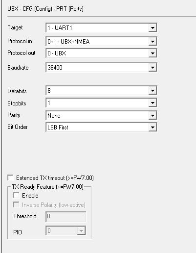
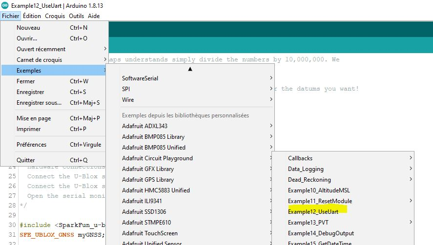

# Building an RTK Rover

## Hardware

In order to build an RTK Rover you need :

* a simplertk2b board with the ZED-F9P ublox chip
* a WiFi NTRIP Master clone attached to the simplertk2b board (See [building ESP32 XBEE](building_esp32_xbee.md))

## Building the rover

* Connect the WiFi NTRIP Master clone to the simplertk2b board.

* Configure the simplertk2b board (See [building ESP32 XBEE](building_esp32_xbee.md) and [README](../README.md)

If everything's ok, you should see the `GPS Fix` led blinking, `NO RTK` led OFF, `XBEE>GPS` blinking (ie RTCM message are received)

## Arduino connexion

### Easy go !

* Configure the `UART1` port to output NMEA messages.

* Connect the PIN 8 (default AltSerial RX pin) to `<TX1` (UART1) 

* !! IOREF should be connected to 5V !!!

* Upload the following sketch, you should see your latitude and longitude on the Serial monitor

* Add the NeoGPS Library : <https://github.com/SlashDevin/NeoGPS/>
* Add the AltSoftSeral Library : <https://www.pjrc.com/teensy/td_libs_AltSoftSerial.html>

```c++
#include <NMEAGPS.h>
#include <GPSport.h>

NMEAGPS  gps; // This parses the GPS characters
gps_fix  fix; // This holds on to the latest values

void setup()
{
  DEBUG_PORT.begin(9600);
  while (!Serial)
    ;
  DEBUG_PORT.print( F("NMEAsimple.INO: started\n") );

  gpsPort.begin(9600);
}

//--------------------------

void loop()
{
  while (gps.available( gpsPort )) {
    fix = gps.read();

    DEBUG_PORT.print( F("Location: ") );
    if (fix.valid.location) {
      DEBUG_PORT.print( fix.latitude(), 6 );
      DEBUG_PORT.print( ',' );
      DEBUG_PORT.print( fix.longitude(), 6 );
    }

    DEBUG_PORT.print( F(", Altitude: ") );
    if (fix.valid.altitude)
      DEBUG_PORT.print( fix.altitude() );

    DEBUG_PORT.println();
  }
}
```

Serial reception can be tested thank to this code below:

```c++
#include <AltSoftSerial.h>

AltSoftSerial altSerial;

void setup() {
  Serial.begin(9600);
  Serial.println("AltSoftSerial Test Begin");
  altSerial.begin(9600);
  altSerial.println("Hello World");
}

void loop() {
  char c;

  if (Serial.available()) {
    c = Serial.read();
    altSerial.print(c);
  }
  if (altSerial.available()) {
    c = altSerial.read();
    Serial.print(c);
  }
}
```

NMEA Enabled High precision may be needed, see <https://learn.sparkfun.com/tutorials/setting-up-a-rover-base-rtk-system/all>

Arduino Library to decode NMEA message

Active only some message to the output
https://wiki.ardumower.de/index.php?title=Ardumower_Sunray#Rover_configuration_.28messages.29

### Using the SparkFun library

This library is quite useful : <https://github.com/sparkfun/SparkFun_u-blox_GNSS_Arduino_Library>

* Connect the PIN 8 to `<TX1` (UART1) 

* Connect the PIN 9 to `>RX1` (UART1) 

* !! IOREF should be connected to 5V !!!

* Configure the `UART1` port as follow



* Use the example `Example12_UseUart`



It's better to use `AltSoftSerial` library so change example code as follow:

```c++
#include <AltSoftSerial.h>
AltSoftSerial mySerial(8,9);

/*#include <SoftwareSerial.h>
SoftwareSerial mySerial(8, 9); // RX, TX. Pin 10 on Uno goes to TX pin on GNSS module.*/
```

## References

* <http://agrilab.unilasalle.fr/projets/projects/autoguidage-rtk-libre/wiki/Ressources>
* <https://learn.sparkfun.com/tutorials/setting-up-a-rover-base-rtk-system/all>
* <https://github.com/sparkfun/SparkFun_u-blox_GNSS_Arduino_Library>
* <https://www.instructables.com/RTK-GPS-Driven-Mower/>
* Faucheuse guidée par GPS RTK : <https://wikifab.org/wiki/Faucheuse_guid%C3%A9e_par_GPS_RTK>

